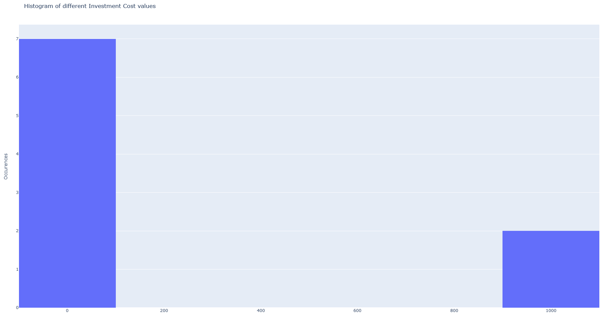
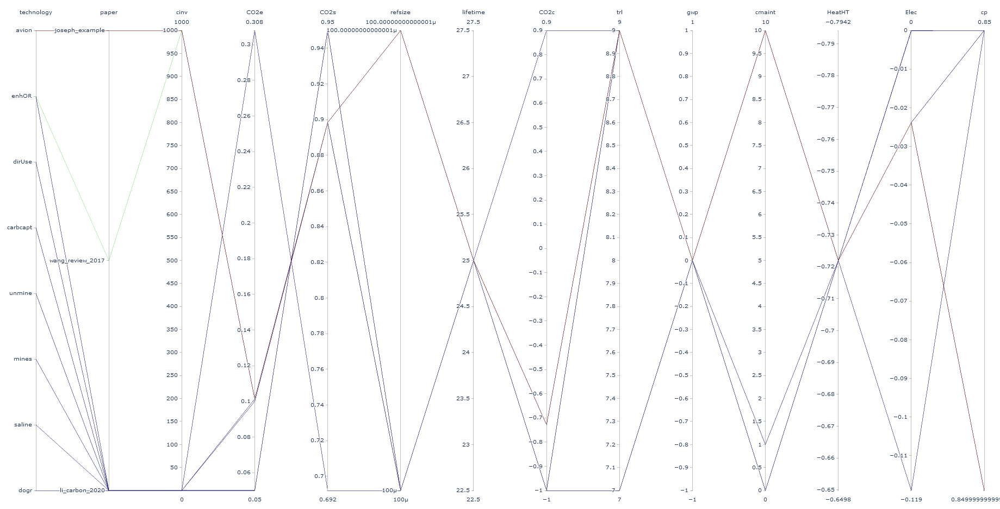

BibDataManagement
++++++++++++++++++++++++

.. card::

    The python package `bibdatamanagement <https://pypi.org/project/bibdatamanagement/>`_ (available on Pypi) provides the
    *BibDataManagement*  class that contains the method needed to read, plot or merge bib files.

How to start
============

1. Install the package in your Python interpreter:

.. code-block:: bash

    pip install bibdatamanagement

2. Import the class in your Python script and initiate a *BibDataManagement* instance:

.. code-block:: python

    from bibdata_management import BibDataManagement

    bib_file = 'your_path/your_file.bib'
    bibdata = BibDataManagement(bib_file)

3. Transform the *.bib* data in a DataFrame:

.. code-block:: python

    df_bib = bibdata.get_data(entry='YOUR_ENTRY', set_name='YOUR_SET')

When initialising a *BibDataManagement* instance, one can also add a *.csv* file that contains the default value for
parameters description (short name, long name, description).

.. code-block:: python

    bibdata = BibDataManagement(bib_file, 'your_default_file.csv')

Reading
========

get_data
--------------------------

.. currentmodule:: bibdatamanagement

.. automethod:: BibDataManagement.get_data

statistics
-----------------------------

.. automethod:: BibDataManagement.statistics

print_info_on_param
-------------------------------------

.. automethod:: BibDataManagement.print_info_on_param

filter_by
-------------------------------------

.. automethod:: BibDataManagement.filter_by

Plotting
========

param_histogram
-------------------

.. automethod:: BibDataManagement.param_histogram

parallel_coord
-------------------

.. automethod:: BibDataManagement.parallel_coord

Others
=======

merge_bib
----------

.. automethod:: BibDataManagement.merge_bib

export_df_to_bibtex
---------------------

.. automethod:: BibDataManagement.export_df_to_bibtex

add_default_values
-------------------

.. automethod:: BibDataManagement.add_default_values

build_additional_set
---------------------

.. automethod:: BibDataManagement.build_additional_set

The **BibDataManagementES** class
==================================

*BibDataManagementES* inherits from *BibDataManagement*. Because it has an additional field from the note format,
some methods are adapted. Moreover, it has an export designed to be used directly in the model.

.. currentmodule::  bibdatamanagement.bibdatamanagement_es

.. automethod:: BibDataManagementES.get_data

.. automethod:: BibDataManagementES.export_df