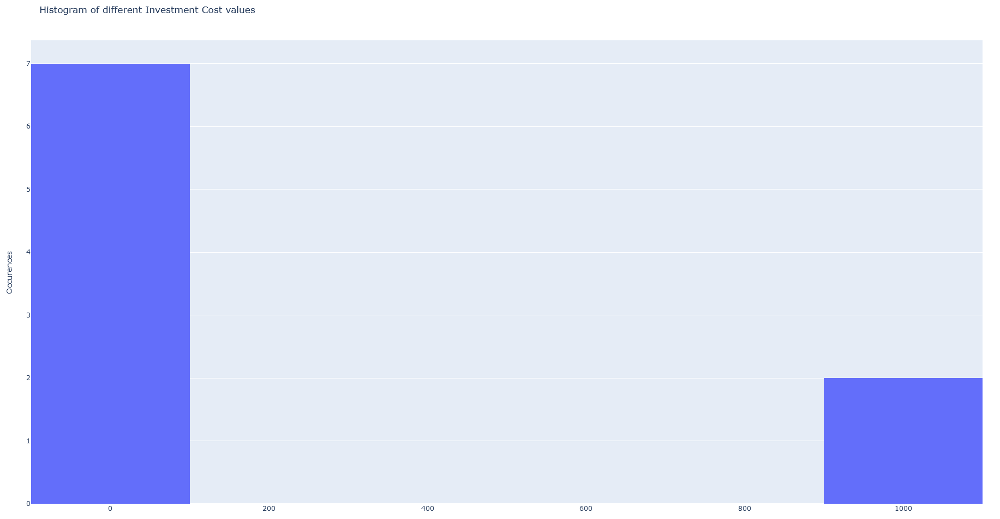

RBibData
++++++++

.. card::

    The **RBibData** class allows the use of the package in Rmarkdown (or Quarto), via a meta-language.
    The following documentation describes the meta-language and how to use it.

.. note::

    Most of the syntax is directly inherited from `ROsmose <https://ipese-internal.epfl.ch/rosmose/index.html>`_
    (it needs to be connected on an EPFL WiFi or on the VPN to access the documentation).

How to start
==============

1. Create a Quarto document

2. Provide the path to the bibliography file in the YAML header and the path to the _default_values_ file if desired:

.. code-block::

    ---
    title: "Bibdata Management"
    author: "Bibdata documentation"
    bibliography: path/bibliography.bib
    params:
        default_values: path/parameters_description.csv
    ---

3. Source the `bibdatamanagement-setup.R` script in your setup chunk:

.. code-block::

    {r setup, echo=F, message=F, warning=F}
    source("https://ipese-internal.epfl.ch/rscripts/bibmanagement-setup.R", local = knitr::knit_global())

or, if you do not have access to the EPFL network:

.. code-block:: R

    {r setup, echo=F, message=F, warning=F}
    source("https://ipese-web.epfl.ch/static/scripts/bibmanagement-setup.R", local = knitr::knit_global())

4. In your document, create a **rbibdata** chunk:

.. code-block:: R

    {rbibdata}
    : SELECT

Basic principles
==================

RBibData commands are divided into 3 elements, described in the first line of the chunk:

.. code-block::

    : SELECT enhor energyscope

1. A **chunk manager**, which works the same way as **rosmose**,
2. A **functionality**, that tells RBibData what to do with the information bellow the first line,
3. Some **arguments** that goes with the functionality,

The functionalities and their arguments are described hereafter.

For now, the package is having trouble to print a plotly graph in an RMarkdown file. If you encounter an issue,
create an rchunk and call ``rbibdata`` as a function, with the string you would have written as an argument.

.. code-block::

    {r}
    rbibdata(': SELECT enhor energyscope')

Functionalities and arguments
===============================

RBibData SELECT
------------------

``: SELECT tech_name(parameters) set_name [tab_options, stat_options]``

       Allows to extract the required data from the bibliography and display it

* **Parameters**:

  * tech_name *(optional)*: The name of the technology to extract.
  * parameters *(optional)*: The name of the parameters to specify, if necessary.
  * set_name *(optional)*: The name of the set of which the data to extract belongs.
  * tab_options *(optional, {'t', 'n', 'v', 'u', 'd', 'c', 's', 'r'}, default 'all')*: Options of the columns to print in the report.
  * stat_options *(optional, {'avg', 'median', 'weighted_avg', 'min', 'max'}, default 'None')*: Compute the statistics from the data required.

    +-----------+-----------------------------+
    | Option    | Description                 |
    +===========+=============================+
    | t         | Name of the technology      |
    +-----------+-----------------------------+
    | n         | Short name of the parameter |
    +-----------+-----------------------------+
    | v         | Value of the parameter      |
    +-----------+-----------------------------+
    | u         | Unit                        |
    +-----------+-----------------------------+
    | d         | Description. Displays as a  |
    |           | footnote                    |
    +-----------+-----------------------------+
    | c         | Comment on the parameter    |
    +-----------+-----------------------------+
    | s         | Set to which the parameter  |
    |           | belongs                     |
    +-----------+-----------------------------+
    | r         | Reference                   |
    +-----------+-----------------------------+

* **Return**: *(DataFrame)*: The selected data are kept in the class under ``current_df``. If the chunk manager is set to *display*, generates a table.

There is two additional options to know: ``*`` and ``-`` after a ``tech_name`` or ``set_name``.

* ``tech_name*`` or ``set_name*``: makes the tech or set one selected by default. Therefore, if one writes ``tech_name*``, the tech will be selected again in the next chunk, even if not specified.
* ``tech_name-`` or ``set_name-``: removes the default behaviour of the specified tech.

.. note::
    Note that if no technology nor set are precised, a median set is computed and returned from the whole bibliography.

**Examples**

----

.. code-block::

    : SELECT enhor(trl) energyscope [tnvudsr]

.. table::
    :name: Model parameters

    +-----------+-------------+-------+------+--------------------+-----------------------+
    | Technology| Parameter   | Value | Unit | Set                | Reference             |
    +===========+=============+=======+======+====================+=======================+
    | enhOR     | tech_ready  | 9     |      | energyscope, first | Wang et al. (2017)    |
    +-----------+-------------+-------+------+--------------------+-----------------------+

RBibData SAVE
--------------

``: SAVE [arguments]``

       Saves a set of data to a temporary file

* **Parameters**:

  * arguments *(optional, {'bib', 'data', 'energyscope'}, default 'bib')*: The format to which the data should be loaded. *'bib'* creates a temporary *.bib* file from the ``current_df``, named *'References.bib'*.
  *'data'* dumps a pickle with the ``current_df``. *'energyscope'* exports a file to be used for Energyscope, named *'tech_values.dat'*.

* **Return**

**Examples**

----

.. code-block::

    : SAVE [data]

RBibData LOAD
--------------

``: LOAD [arguments]``

       Load a set of data from a temporary file

* **Parameters**:

  * arguments *(optional, {'bib', 'data'}, default 'bib')*: The format from which the data should be loaded. *'bib'* loads a *.bib* file and so creates a new dataset from which the data can be selected.
  *'data'* loads a pickle with the name of some technologies, parameters and sets and define them as default. The ``current_df`` is updated.

* **Return**: *(RBibData)*: A modified *RBibData* object, where the right attributes are modified.

**Examples**

----

.. code-block::

    : LOAD [data]

RBibData PARCOORDS
-------------------

``: PARCOORDS*file_name tech_name(parameters) set_name [arguments]``

       Displays a parallel coordinates plot in Plotly

* **Parameters**:

  * file_name *(optional, default: temp/parcoords.html)*: The name to which the figure should be saved. Must be separated from the functionality by ``*``.
  * tech_name *(optional)*: To specify a technology to filter by.
  * set_name *(optional)*: To specify a set to filter by.
  * arguments *(optional, {'paper', 'tech', 'both'}, {'png', 'html'}, default {'paper', 'html'})*: The arguments that can be passed. The first three are the options to color the lines of the plot. The last two are for the figure's export format.

* **Return**: *(Plotly)* A plotly parallel coordinates figure of the specified df.

.. note::

    Note that if no technology nor set are precised, the function uses the ``current_df`` that exists from a previous **SELECT**.
    If there was no previous SELECT, then the median set is plotted.

**Examples**

----

.. code-block::

    rbibdata(": PARCOORDS enhor ['both', 'html']")

.. image:: ../images/par_coord.png

RBibData HISTOGRAM
------------------

``: HISTOGRAM*file_name tech_name(parameters) set_name [arguments]``

       Displays an histogram of the occurrences of a technology parameter in Plotly

* **Parameters**:
  * file_name *(optional, default: temp/parcoords.html)*: The name to which the figure should be saved. Must be separated from the functionality by ``*``.
  * tech_name : To specify a technology to filter by.
  * set_name : To specify a set to filter by.
  * arguments *(optional, {'png', 'html'}, default {'html'})*: The arguments are for the figure's export format.

* **Return**: *(Plotly)* An histogram figure of the specified technology parameter.

**Examples**

----

.. code-block::

    rbibdata(": HISTOGRAM enhor(trl) ['html']")

